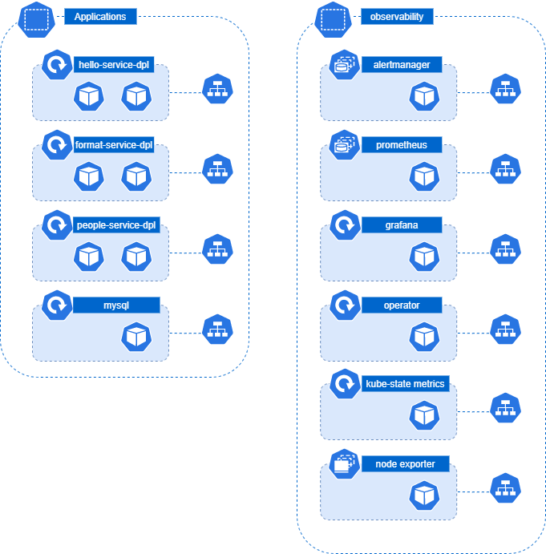
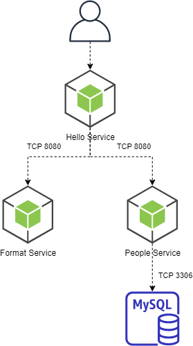

## Part 1 - Metrics

This repository is meant to demonstrate the deployment of Prometheus using a Helm Chart and the Operator, and the use of Prometheus to collector metrics for 3rd party systems and services.

This folder contains the following resources:

1. 3 Microservices on the services folders.
2. yaml files with the Kubernetes resources on the K8s folder.
3. The makefile with scripts to perform different operations.


### Kubernetes Resources (simplified)



### Sample Services

There are 3 Nodejs containers:

**People Service**: Service with a simple query to get data from a table in MySQL.

**Format Service**: Service that will format a message using the values from the People Service.

**Hello Service**: Service that will call the previous services and send the final message to the user.




To test the services open a terminal and run:
```sh
kubectl port-forward service/hello-service-svc -n applications 8080
```
Then on another terminal run the following:
```sh
curl http://localhost:8080/sayHello/iroh
```

### Deploy Prometheus

```sh
make deploy-prometheus
```

### Deploy the sample application

```sh
make deploy
```

### Clean Resources

```sh
make clean
```

### Load test:

Open a terminal and run:
```sh
kubectl port-forward service/hello-service-svc -n applications 8080
```
Then on another terminal run the load test:
```sh
make load-test
```

### Expose Prometheus

```sh
kubectl port-forward service/prometheus-operated -n observability 9090
```