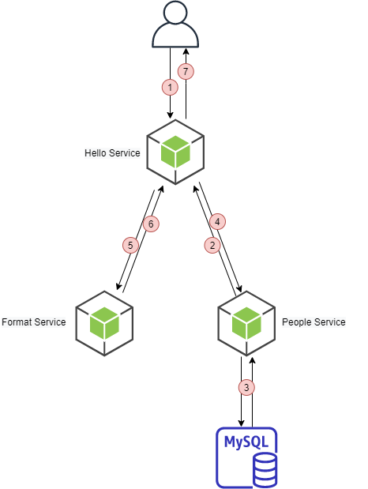

### Part 3 - Distributed Tracing

This repository is meant to demonstrate the distributed tracing with Jaeger and OpenTelemetry.

This folder contains the following resources:

1. Jaeger deployment file.
2. Jaeger url configMap for services.
3. Services with Opentelemetry configured.

### Service Flow



### Jaeger Deployment

```sh
make deploy-jaeger
```

### Services Deployment

```sh
make
```

### Test

```sh
kubectl port-forward service/hello-service-svc -n applications 8081:8080
```

```sh
# On another terminal
curl http://localhost:8081/sayHello/iroh
```

### Clean

```sh
make clean
```